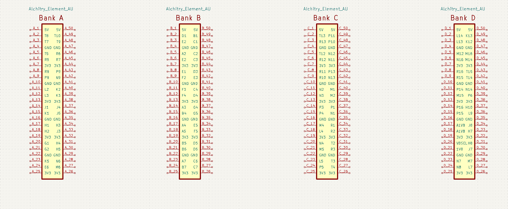
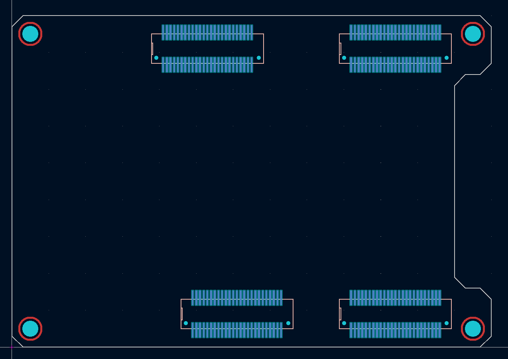
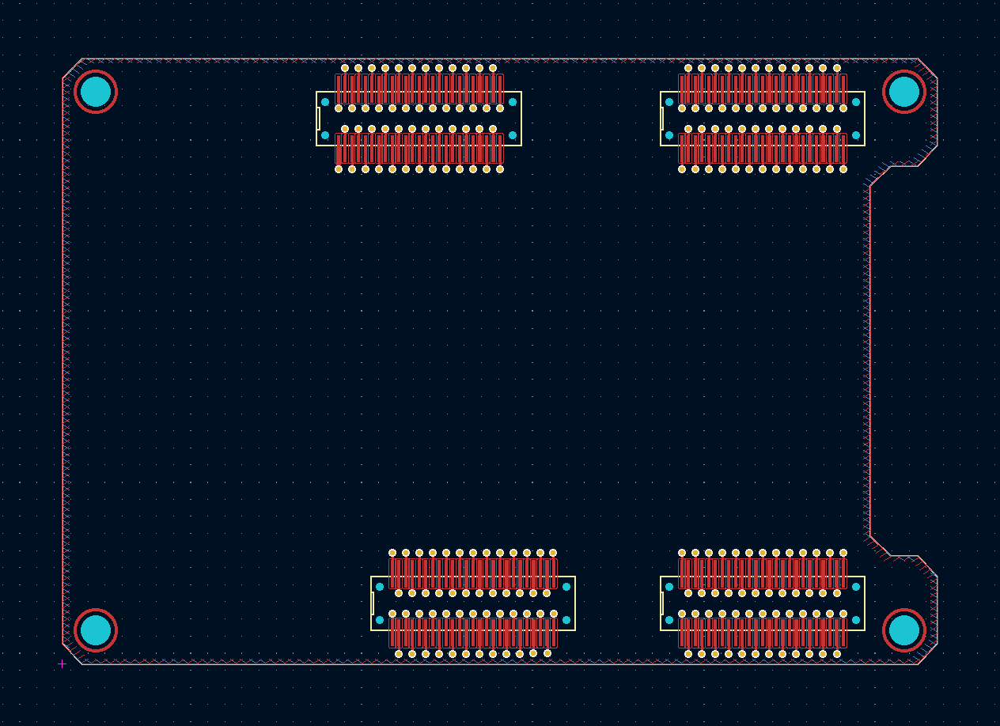
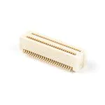
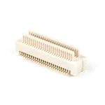

# Alchitry FPGA shield for KiCad

  ![KiCad](https://img.shields.io/badge/KiCad-314CB0?logo=data%3Aimage%2Fpng%3Bbase64%2CiVBORw0KGgoAAAANSUhEUgAAAGQAAABkCAIAAAD%2FgAIDAAAIl0lEQVR42u2cBVQjSxaGZ93d3R2SjLt7Ooy7u7sFxgcdd7fnjpPgMIo7jC%2Fu7hLr3L279fxxHl1F9hCo%2Fs8%2FPlV0vq66pZdewInMBihIgtAD8PJsuDQerjnBW4sg9gbUFYJVBGniA1ZBPFwYDtovgbbXJ7ynFxz4AfhsgeZqGRaA1Qox18Hl64jm8%2Bz6Oyh7zD2shFdhD2lQHdntd1BfzDGskjRw%2BQaCkOrrarCYuIQlmuHGRERA4y%2FBkzAuYdXkwr5vIwI6Xx4HVrFjWEajOeNRbkzc457hXO9TONjRwhL3%2FzAxJvnDSjIf55kt4qdh5eSVK4ft%2BeFfV%2F%2Fk72t6gH%2F6j7WXZvWhI0Xs3GvSgDkf1oNABo7dV1xa8wlYs1ec%2Fo3jup5jxQbvhX9jgzVv%2BPSPV%2FVrh3WbnW9%2FBAs7oOOI3T0L1vrb8xRssKYNnfep2sbOcLdgZySwDEbTv4bvIv%2FwW%2BWmvw499tdhx7u7XWfNYIBl1H5z6Jgj%2F61hiBcSJ0xGT3cztwvrd6qtKrV3b41%2Fd%2Ff8mRcs2i%2FTwnq%2B9W%2BOgh8WV05%2B57eKjbzA6qd57%2BmWf9DCcl2yA8tyB0ul8V83142qceXu%2BFM%2FJ28eYaFVgl%2FgekEiKcOery2efQpLcQoL3Vfw1q0dK2o7WEu37v66doGLUhPANSx0H42v6%2BLt1Tt%2F1C4m5JixWTF75jlCindYJH4Nm%2FLmqeWbUzYrq3f%2BrGXPd5v3fK9kx29D1o1aPedYH%2BHDz8sK628TfP8w1ofZfx7vK%2F3DOE72wyKd9D8n%2BnX4hRQafweN%2F%2BBpvgOn%2BPzrk02JHZZS8L%2FwymOzWbSIVhZbrK%2F7Z%2Fdxkgpr%2BZ77pCCzyytbd3kmKAUbNEOWltV3akBMcjkwKb%2BoceCMIOlPNmtDFHkaNmU8rRm3OFRlO1IsMWvWxmiTmeUzeF3JoHr0jYdigVWJGZWDZpIX06WwsFXnFjUBvYbN0Ut%2FLIXa7z19LjDpWU59%2F2mBWElXwyIfQ5dD3QeLG%2F8xkSK6D52rNxgsQK%2FnufWDSGe3B1jYlU7dyARKRTwoRsqSJ9n%2B%2BuhCoFdhafOYRaFYg73AQrscTwZKXXrjmWRSGK3icCwDSjU0Gqavj8LZk33B2uoaD5TyuJIptQPO0VfVtgG99p5IIrME%2B4KFb572vR84kyppC2VqwL34UvoDZuvt957jJBZr6AmwnE8mdzxlV%2FudupVltQKtQu4W9SZzXU5gYaha7fKQYRaa9axmwHQc%2FniCNW5JaF29AShV32hUrwjH4hzBGjRT9zSnDiiFz7r5cBw2SY5g9ZkSEBhZwBDUT97IUqixBm5g4WDvdTldpJ9V%2BYXlkYkCR7CmrYu0WKhJPc0mqz%2BeYI1ZFFJNP%2F%2BsrjOQoM4RrIHTgx6%2FqKUO6mZxzb4YtqCu%2Bt8uAIO7GpZTgE9oHsNV0GNXM5hD1Yi5el1Uvi6Szm%2F5v8B1RVfC2u2VKNJP1QMj8hWspMjm0sveL4BSVTWt%2FacHdQ0s7AtOayMZ9qoyn9b0ndrZoD5qfnBtvaHbwBq7KKSsshUoVVHVOml5mE2CdNj94u4Bq9%2FUwJSsKqAUzi2W7r5vk5k6VuJxMa0bwMIHvf3uc6DXqZtZSsFmB6sbDsbaOyztiWTcMsSBn3ZNg4Omo03XNKucH9o7rKtvPW1pNQOlkjIrbT5TX7rrvr3DYljTlFe14mhg81n4kp32C4tdy3bfZ2DBHSxRtB6%2FltHx0ZkMC2vG%2ByOSJgoyrKSMyr5TAhgocAersrptjMSgLsNat1%2Fy9osM6119rtTzdxmWySxuc41XCTIsqQ%2FXNmS2ToYlVXGpFXg%2BJsOSqsuvP3WUJ6USZRGtK50fqGRYElVY0jR4lk6GJVVBUQUqDmG1tJpYOqPF6nI8SSVwBuvY9czGJiPQq7XN7LQ6gi9YzieSt7snkKNChmvhODJyBIuc7vjiKTST3gzM5g4Wjm45BY1sy6DNR%2BJUAkewyB2jKAxDLMugWrJ7wxMsbB2Hz6YAk%2B4nlCnUPMFC%2F3OSH17GBiadf%2Fkx7s1zBAs9fJ4exzigFx7T4qmPiitY6IXb7xpNItCrqKwZs%2FH4gqVU%2B1954ykwCXPGVAJPsMg1Ddy6YjtY3OmZgLw4gkXSBfBEB%2BjV1GzSrIrgCxZ6hfaBiSl45RU14oYqX7DQr%2Fr%2BG5j0RkC2UuAMFt4IxGvebMsgTNJXCTzBQqtXhjc0GoFeeDNp9MIQvmBh61h%2FIIZtDyc2pULFFSxyT%2F0tXS4w6fTNLCzeQ2C5nEyR8kkGzwrKzm9gm3kt2HbXHmFtORIHlHK7mC6xm%2BAyyGC0AL0KiptGzNP%2FP2AN6AysXZ6J1N3k5ScSYeFU4DXfF8AkTAjoMHgt200HC%2FPWBsxghYWR2PV8GlDqHV2u9AnRsDm6xiYT2zfF97ycrhRsebUb01cGztQxwlKq%2FW698wwolfmkGrexpOdBHL2SAUwymT4vxw7b3TbXONqc9cGzWGE5TvZLSKNe%2FRpNln9IhkVy7IwkcjGdns3dcgd5tdvHT9%2FKoqU%2FZmEII6xRC4JxEQv02nQ4Tjosh0nklTAKc6kmLA1tJ3ndKeBhUilQyuVEEgssfF1nbmcBk%2B7GleJUSHqY9w3Lh04I108Dpn86O2PisjBM9GDI3nOY7EcNa87m6JYWE5lk0f6M%2B6Jr9z2UCAsfLjalnJRl%2FhmnbJpV4R9%2FAThcstXmdiFNJVDC2nI4xu18qtv5FLafd3nE9XUKkAILj6CdjyaQUsw%2Fo7VeH%2B0RjlkQ7H4hla22w2eS6bshWuiEKXMDbWGb1UkNi3PLsGRYMqxuA0vJPSy0YpIEWOhfO6zm3ug1iKIdWKJoHTRxH%2F5tu5Y9bfEJq9VKYKHgde%2FYX%2Fxzrczls%2F6143r%2F4ERAfQgLyb3tGzNzxekJsz0%2BtOxZK868FxBLmhXqP1lKn2LakEpWAAAAAElFTkSuQmCC)

A KiCad library for shields for Alchitry fpga boards.

This library is made for KiCad 6 and above.

## Symbols

This library contains the following symbols:

- Alchitry_Element_CU
- Alchitry_Element_AU

The Pin names (inside the box) correspond to the actual hardware pins of the FPGA's. If you are using Alchitry Lab's or have a constraints file with the pin numbers according to Alchitry just look at the pin numbers (above pin).

## Footprints

All footprints already contain the correct board outline and mounting holes. The mounting holes are 2.2mm in diameter and are designed for M2 screws.

This library contains the following footprints:

- Element
- Element_no_top

The Element_no_top footprint is the same as the Element footprint but without the top connector. This is useful if you don't plan on stacking anything on top of your shield.

When using the normal Element footprint it is best to use it with the provided template project. This project has all the via's and traces for connecting the top connector to the bottom connector.

## Installation

1. Clone this repository into your KiCad library folder
2. Go to `Preferences -> Manage Symbol Libraries...`
3. Click the folder icon and open the `Alchitry_Element.kicad_sym` file from this repository
4. Click `OK`
5. Go to `Preferences -> Manage Footprint Libraries...`
6. Click the folder icon and open the `Alchitry_Element.pretty` folder from this repository
7. Click `OK`

All Done! You can now use the Alchitry Element symbols and footprints in your KiCad projects.

## Parts

The needed connectors to interface with the Alchitry boards are:

- PRT-16891 (Top Connector)

- PRT-16890 (Bottom Connector)

They can be found on mouser, digikey, and sparkfun.

I have also attached a pin Reference for the Alchitry Au in the attachments folder.
